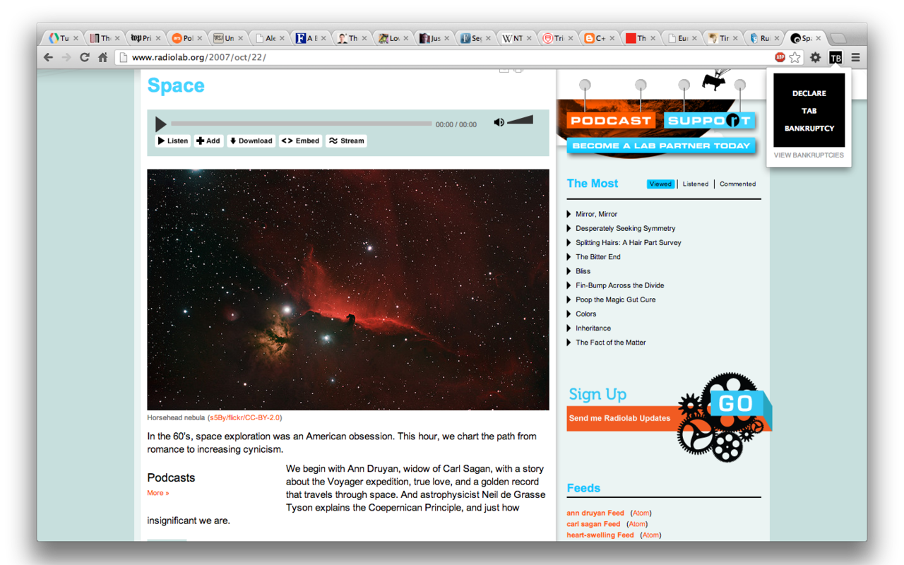
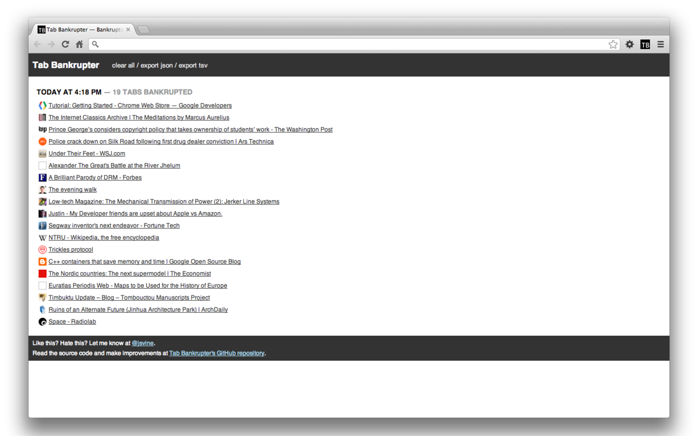

# Tab Bankrupter

A Chrome extension for declaring "tab bankruptcy" without losing all your links.

## Install

For the latest release, [install Tab Bankrupter from the Chrome Web Store](https://chrome.google.com/webstore/detail/tab-bankrupter/pndipmgldhbejkehopnbbpjgidkbiimh).

For the most recent build, clone this repository to your computer, and follow Google's [instructions for loading unpacked extensions](http://developer.chrome.com/extensions/getstarted.html#unpacked).

## Background

Declaring "tab bankruptcy" is to your browser what declaring "email bankruptcy" is to your inbox. Faced with an overwhelming number of browser tabs sapping your focus and slowing down your computer, you decide to wipe them out all at once.

The earliest reference I can find to "Tab Bankruptcy" is a May 2007 [blog post by Martin Gordon](http://www.martingordon.org/blog/2007/05/28/blogging-productivity-tip-declare-tab-bankruptcy/). In December 2007, Marc Hedlund [wrote about the strategy for O'Reilly Radar](http://radar.oreilly.com/2007/12/tab-bankruptcy.html):

> I apologize, but I am declaring tab bankruptcy. I will do so every Saturday from now on. If I haven’t gotten back to that tab by Saturday morning, I'm force-quitting Firefox and no, dammit, I won't try to restore my last session.

Perhaps force-quitting is a bit extreme for you. Perhaps you don't want to have to restart your browser, perhaps you want a record of the tabs you've relinquished. Then Tab Bankrupter is for you. It's an extension for Google's Chrome browser that lets you declare tab bankruptcy without quitting, and keeps track of the bankruptcies you've declared. It also skips pinned tabs, so you can hold onto Gmail, or whatever else you still want open.

## Privacy

Tab Bankrupter has access only to the metadata about your tabs — URL and title being the most interesting.

Tab Bankrupter keeps all your data on your computer. It does not  share your data or actions with anybody.

Tab Bankrupter does not load any "external" resources, such as analytics scripts, Facebook widgets, et cetera.

## Thanks

Many thanks to the following GitHub users for finding bugs and/or contributing code:

- [@zencephalon](https://github.com/zencephalon)
- [@slinhart](https://github.com/slinhart)

## Interested in Contributing?

Please do.
